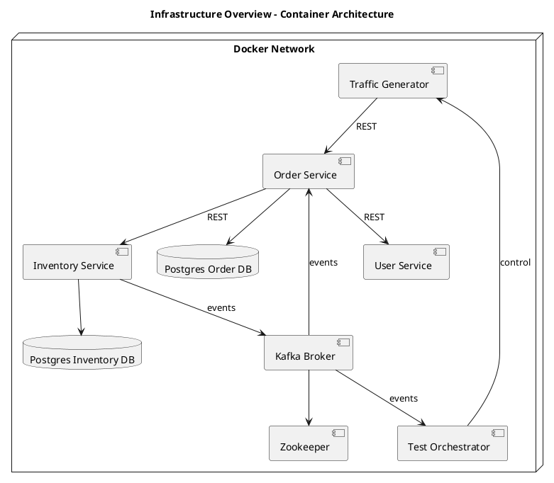

# Infrastructure Design

## 1. Overview

The system is deployed as a distributed set of Docker containers orchestrated using Docker Compose.

It consists of three logical layers:

1. Application Layer (business services)
2. Messaging Layer (Kafka)
3. Testing & Control Layer (Orchestrator + Traffic Generator)

Each layer is a first-class part of the system and participates in runtime behavior.

---

## 2. Architecture Layers

### 2.1 Application Layer

1. user-service
2. order-service
3. inventory-service

Responsibilities:
- business logic execution
- REST API exposure
- state persistence
- event production and consumption

Each service:
- owns its database
- communicates via REST and Kafka

---

### 2.2 Data Layer

1. postgres-order
2. postgres-inventory

Responsibilities:
- service-level data storage
- isolation of data domains

---

### 2.3 Messaging Layer

1. kafka (broker)
2. zookeeper

Responsibilities:
- event storage
- event distribution
- asynchronous communication backbone

---

### 2.4 Testing & Control Layer

This layer is an integral part of the architecture.

#### Test Orchestrator (Control Plane)

Responsibilities:
1. defines test scenarios
2. controls execution
3. listens to Kafka events
4. validates system behavior
5. analyzes logs

---

#### Traffic Generator (Execution Plane)

Responsibilities:
1. generates system traffic
2. executes orchestrator scenarios
3. simulates external clients
4. sends REST requests to services

---

## 3. Communication Model

### 3.1 REST Communication (Synchronous)

Used for:

1. Order → User (validation)
2. Order → Inventory (submission)
3. Traffic Generator → Services (simulation)
4. Test Orchestrator → Traffic Generator (control)

Characteristics:
- blocking
- immediate feedback
- deterministic

---

### 3.2 Kafka Communication (Asynchronous)

Used for:

1. Inventory → Order (order lifecycle events)
2. Services → Test Orchestrator (observation)
3. Optional control channel

Characteristics:
- non-blocking
- event-driven
- eventual consistency

Events are partitioned and keyed by `orderId` to guarantee ordering within a single order lifecycle.

---

## 4. Scenario Execution Model

The system separates decision-making from execution.

Flow:

1. Test Orchestrator defines scenario
2. Traffic Generator executes scenario
3. Services process requests
4. Inventory produces events
5. Order updates state
6. Orchestrator validates outcomes

---

## 5. Networking

Docker Compose provides internal DNS.

All services run within a shared Docker network and communicate via service discovery using container names.

Services communicate using container names such as:

- order-service:8080
- user-service:8080
- inventory-service:8080
- kafka:9092

---

## 6. Deployment Model

The system is started using:

```bash
docker-compose up
```

This initializes all services, databases, Kafka, and testing components.

---

## 7. Design Principles

1. Separation of concerns
2. Event-driven architecture
3. Independent scalability
4. Testability as a core feature
5. Clear separation between control plane and execution plane

---

## 8. Infrastructure Diagram

This diagram presents the runtime container architecture and communication paths.


