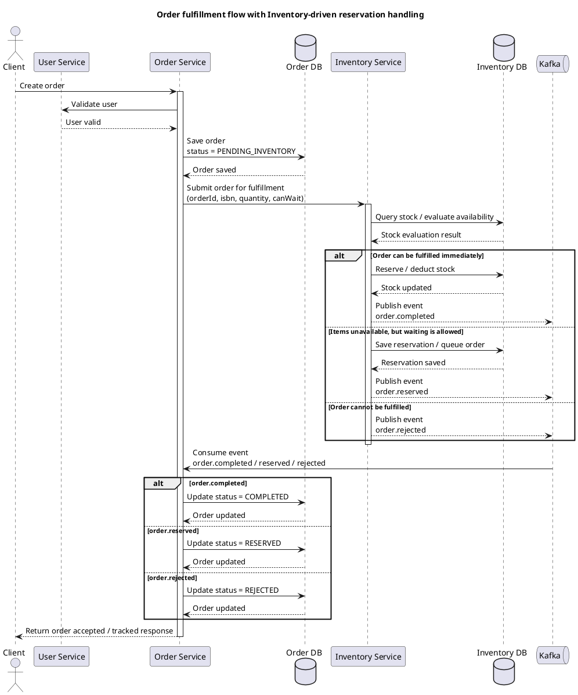

# System Logic

## 1. Overview

This document describes the business logic and communication flow of the system.

The system is a **book order and fulfillment platform**. The inventory consists exclusively of physical books (hardcover and paperback). Each book is uniquely identified by its ISBN and carries the following attributes: title, author, genre, publisher, publication year, language, format, price, and available copies.

Supported genres: `SF`, `HISTORICAL`, `CRIME`, `FANTASY`, `CLASSIC`, `BIOGRAPHY`, `POPULAR_SCIENCE`.

The system follows a hybrid architecture:
- synchronous communication (REST),
- asynchronous communication (Kafka events).

---

## 2. Core Principles

1. Order Service owns order state.
2. Inventory Service owns fulfillment decisions.
3. REST = commands
4. Kafka = events
5. Eventual consistency

---

## 3. Order Lifecycle

PENDING_INVENTORY → RESERVED → COMPLETED
                         ↘
                          REJECTED

---

## 4. Sequence Diagram (FINAL)

---

## 5. Key Design Decisions

1. Inventory owns reservation queue
2. Order does NOT poll Inventory
3. Inventory pushes state via Kafka
4. Order reacts to events
5. Clear separation of responsibilities

---

## 6. Summary

- REST → command
- Kafka → state propagation
- Inventory = execution engine
- Order = state holder

---

## 7. Seed ISBNs

The inventory database is pre-seeded (via `V2__seed_books.sql`) with three books that cover all fulfillment decision paths:

| ISBN          | Title                          | Stock | Decision path                          |
|---------------|--------------------------------|-------|----------------------------------------|
| 9780451524935 | 1984 — George Orwell           | 10    | `COMPLETED` (any `canWait` value)      |
| 9780141028088 | The Hound of the Baskervilles  | 0     | `RESERVED`  (requires `canWait=true`)  |
| 9780060935467 | The Art of War                 | 0     | `REJECTED`  (requires `canWait=false`) |

Use these ISBNs in E2E tests or manual verification after `docker compose up`.
